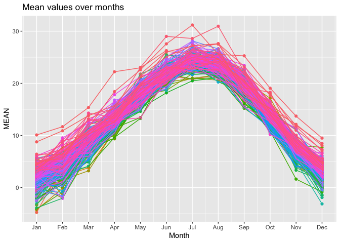

DS202-FinalProject
================
Corbin Graham, Coleman Dimmer
2023-12-12

# DS 201 Final Project

**Authors: Corbin Graham, Coleman Dimmer**

## Description

The goal of this project is to demonstrate climate trends related to
temperature throughout time. We are using data provided by National
Centers for Environmental Information (NCEI) for the Milan weather
recording station of Milan, Italy. Using graphs, charts, and statistical
analysis, we will be able to visualize and demonstrate climate trends
for this location.

We chose this location due to the timeframe and data provided. We will
be using monthly weather (temperature) data from January 1763 to
November 2008.

## Introduction

-- Introduction Here –

^Clearly and concisely describes the topic, and why it is of interest.
Sets up a clear roadmap for the rest of the paper.

### Data Background

-- Information about the data –

The dataset we chose is monthly climate data recorded in Milan, Italy,
between January 1763 and November 2008. We can use this data to analyze
climate patterns. etc.

^Clearly and concisely describes the data and all relevant variables

#### Dataset

[Milan Weather Recording Station from NCEI
(https://www.ncei.noaa.gov/access/search/data-search/global-summary-of-the-month?startDate=1800-01-03T00:00:00&endDate=1800-01-03T23:59:59)](https://www.ncei.noaa.gov/access/search/data-search/global-summary-of-the-month?startDate=1800-01-03T00:00:00&endDate=1800-01-03T23:59:59)

#### Data Columns

- Extreme maximum precipitation
- Extreme maximum temperature
- Precipitation
- Number days with maximum temperature greater than 90F (32.2C)
- Number days with greater than 0.10 inch (2.54mm) of precipitation
- Heating Degree Days Season to TIME
- Heating Degree Days
- Number days with maximum temperature greater than 70F (21.1C)
- Cooling Degree Days Season to Date
- Number days with greater than 0.01 inch (0.25mm) of precipitation
- Day of month of highest daily total of precipitation
- Extreme minimum temperature
- Number days with minimum temperature less than 32F (0C)
- Number days with minimum temperature less than 0F (-17.6C)
- Day of month with extreme maximum temperature
- Number days with maximum temperature less than 32F (0C)
- Number days with greater than 1.00 inch (25.4mm) of precipitation
- Cooling Degree Days
- Average Maximum Temperature
- Average Average Temperature
- Average Minimum Temperature
- Day of month of extreme minimum temperature

## Importing Data

Now that we have determined the dataset we wish to use, it is as simple
as downloading it from the official source found to the CSV format. This
allows us to easily import it as a malleable object.

#### Importanting Libraries

``` r
library(tidyverse)
```

    ## ── Attaching core tidyverse packages ──────────────────────── tidyverse 2.0.0 ──
    ## ✔ dplyr     1.1.3     ✔ readr     2.1.4
    ## ✔ forcats   1.0.0     ✔ stringr   1.5.0
    ## ✔ ggplot2   3.4.3     ✔ tibble    3.2.1
    ## ✔ lubridate 1.9.3     ✔ tidyr     1.3.0
    ## ✔ purrr     1.0.2     
    ## ── Conflicts ────────────────────────────────────────── tidyverse_conflicts() ──
    ## ✖ dplyr::filter() masks stats::filter()
    ## ✖ dplyr::lag()    masks stats::lag()
    ## ℹ Use the conflicted package (<http://conflicted.r-lib.org/>) to force all conflicts to become errors

``` r
library(dplyr)
library(ggplot2)
```

The libraries we are using are for inline operations, and plotting.

#### Important Data from CSV

``` r
data <- read_csv("milan.csv")
```

    ## Rows: 2949 Columns: 50
    ## ── Column specification ────────────────────────────────────────────────────────
    ## Delimiter: ","
    ## chr (25): STATION, DATE, NAME, CDSD_ATTRIBUTES, CLDD_ATTRIBUTES, DP01_ATTRIB...
    ## dbl (25): LATITUDE, LONGITUDE, ELEVATION, CDSD, CLDD, DP01, DP10, DP1X, DT00...
    ## 
    ## ℹ Use `spec()` to retrieve the full column specification for this data.
    ## ℹ Specify the column types or set `show_col_types = FALSE` to quiet this message.

``` r
head(data)
```

    ## # A tibble: 6 × 50
    ##   STATION   DATE  LATITUDE LONGITUDE ELEVATION NAME   CDSD CDSD_ATTRIBUTES  CLDD
    ##   <chr>     <chr>    <dbl>     <dbl>     <dbl> <chr> <dbl> <chr>           <dbl>
    ## 1 ITE00100… 1763…     45.5      9.19       150 MILA…   0   E                 0  
    ## 2 ITE00100… 1763…     45.5      9.19       150 MILA…   0   E                 0  
    ## 3 ITE00100… 1763…     45.5      9.19       150 MILA…   0   E                 0  
    ## 4 ITE00100… 1763…     45.5      9.19       150 MILA…   0   E                 0  
    ## 5 ITE00100… 1763…     45.5      9.19       150 MILA…   7.4 E                 7.4
    ## 6 ITE00100… 1763…     45.5      9.19       150 MILA…  78   E                70.6
    ## # ℹ 41 more variables: CLDD_ATTRIBUTES <chr>, DP01 <dbl>,
    ## #   DP01_ATTRIBUTES <chr>, DP10 <dbl>, DP10_ATTRIBUTES <chr>, DP1X <dbl>,
    ## #   DP1X_ATTRIBUTES <chr>, DT00 <dbl>, DT00_ATTRIBUTES <chr>, DT32 <dbl>,
    ## #   DT32_ATTRIBUTES <chr>, DX32 <dbl>, DX32_ATTRIBUTES <chr>, DX70 <dbl>,
    ## #   DX70_ATTRIBUTES <chr>, DX90 <dbl>, DX90_ATTRIBUTES <chr>, DYNT <dbl>,
    ## #   DYNT_ATTRIBUTES <chr>, DYXP <dbl>, DYXP_ATTRIBUTES <chr>, DYXT <dbl>,
    ## #   DYXT_ATTRIBUTES <chr>, EMNT <dbl>, EMNT_ATTRIBUTES <chr>, EMXP <dbl>, …

Since we have already downloaded our data to a CSV file, we only need to
import it from that file.

#### Data Time Frame

``` r
min(data$DATE)
```

    ## [1] "1763-01"

``` r
max(data$DATE)
```

    ## [1] "2008-11"

This function returns the first, and last date in the dataset. The first
date is January, 1763, and the final date is November, 2008.

#### Data Columns

``` r
colnames(data)
```

    ##  [1] "STATION"         "DATE"            "LATITUDE"        "LONGITUDE"      
    ##  [5] "ELEVATION"       "NAME"            "CDSD"            "CDSD_ATTRIBUTES"
    ##  [9] "CLDD"            "CLDD_ATTRIBUTES" "DP01"            "DP01_ATTRIBUTES"
    ## [13] "DP10"            "DP10_ATTRIBUTES" "DP1X"            "DP1X_ATTRIBUTES"
    ## [17] "DT00"            "DT00_ATTRIBUTES" "DT32"            "DT32_ATTRIBUTES"
    ## [21] "DX32"            "DX32_ATTRIBUTES" "DX70"            "DX70_ATTRIBUTES"
    ## [25] "DX90"            "DX90_ATTRIBUTES" "DYNT"            "DYNT_ATTRIBUTES"
    ## [29] "DYXP"            "DYXP_ATTRIBUTES" "DYXT"            "DYXT_ATTRIBUTES"
    ## [33] "EMNT"            "EMNT_ATTRIBUTES" "EMXP"            "EMXP_ATTRIBUTES"
    ## [37] "EMXT"            "EMXT_ATTRIBUTES" "HDSD"            "HDSD_ATTRIBUTES"
    ## [41] "HTDD"            "HTDD_ATTRIBUTES" "PRCP"            "PRCP_ATTRIBUTES"
    ## [45] "TAVG"            "TAVG_ATTRIBUTES" "TMAX"            "TMAX_ATTRIBUTES"
    ## [49] "TMIN"            "TMIN_ATTRIBUTES"

This function prints out all of the column names in the original
dataset.

## Data Cleaning

Now that we have successfully imported the data, we will clean up our
data object so our results are more accurate, and understandable.

#### Finding Important Variables

To ‘weed out’ invaluable variables, we will search for variables that
lack the proper time frame, are null, or incomplete.

``` r
# Determine if the location value changes
# TODO: Coleman

# Determine if all variables have the same time frame
# TODO: Coleman
```

#### Creating a Clean Object

Drop null values, drop precipitation data (due to lack of data within
timeframe), and remove location data since all of the recordings
happened from the same location.

``` r
#Grabs data and names columns to more reasonable col names. NOTE: DX and DY values are in degrees F, so changed to more accurate degrees C titles to match all other vars. 
milanClimate <- data %>%
  select(
    DATE,
    MEAN = TAVG,
    MEAN_MAX = TMAX,
    MEAN_MIN = TMIN,
    HEAT_DEG_DAYS = HTDD,
    COOL_DEG_DAYS = CLDD,
    HIGHEST_TEMP = EMXT,
    HIGHEST_DAY = EMXT_ATTRIBUTES,
    COOLEST_TEMP = EMNT,
    COOLEST_DAY = EMNT_ATTRIBUTES,
    GTE_32 = DX90,
    GTE_21 = DX70,
    GTE_00 = DX32,
    LTE_00 = DT32,
    LTE_N18 = DT00
  )

milanClimate$DATE <- lubridate::ym(milanClimate$DATE)

milanClimate$HIGHEST_DAY <- as.numeric(substr(gsub('\\D','',milanClimate$HIGHEST_DAY), nchar(gsub('\\D','',milanClimate$HIGHEST_DAY))-1, nchar(gsub('\\D','',milanClimate$HIGHEST_DAY))))

milanClimate$COOLEST_DAY <- as.numeric(substr(gsub('\\D','',milanClimate$COOLEST_DAY), nchar(gsub('\\D','',milanClimate$COOLEST_DAY))-1, nchar(gsub('\\D','',milanClimate$COOLEST_DAY))))

colnames(milanClimate)
```

    ##  [1] "DATE"          "MEAN"          "MEAN_MAX"      "MEAN_MIN"     
    ##  [5] "HEAT_DEG_DAYS" "COOL_DEG_DAYS" "HIGHEST_TEMP"  "HIGHEST_DAY"  
    ##  [9] "COOLEST_TEMP"  "COOLEST_DAY"   "GTE_32"        "GTE_21"       
    ## [13] "GTE_00"        "LTE_00"        "LTE_N18"

## Marginal Summaries

Now that we have a cleaned data object, we can begin to plot charts to
find and demonstrate different trends.

### Max Temperature and Minimum Temperature with Date

``` r
subset_min <- milanClimate %>%
  filter(MEAN == min(MEAN, na.rm = TRUE)) %>%
  select(DATE, MEAN, MEAN_MIN, MEAN_MAX)
subset_min
```

    ## # A tibble: 1 × 4
    ##   DATE        MEAN MEAN_MIN MEAN_MAX
    ##   <date>     <dbl>    <dbl>    <dbl>
    ## 1 1767-01-01 -4.75    -6.72    -2.77

``` r
subset_max <- milanClimate %>%
  filter(MEAN == max(MEAN, na.rm = TRUE)) %>%
  select(DATE, MEAN, MEAN_MIN, MEAN_MAX)
subset_max
```

    ## # A tibble: 1 × 4
    ##   DATE        MEAN MEAN_MIN MEAN_MAX
    ##   <date>     <dbl>    <dbl>    <dbl>
    ## 1 2006-07-01  31.2     25.8     36.5

``` r
subset_min_max <- bind_rows(subset_min, subset_max)
subset_min_max # Highest and Lowest Temperatures
```

    ## # A tibble: 2 × 4
    ##   DATE        MEAN MEAN_MIN MEAN_MAX
    ##   <date>     <dbl>    <dbl>    <dbl>
    ## 1 1767-01-01 -4.75    -6.72    -2.77
    ## 2 2006-07-01 31.2     25.8     36.5

``` r
ggplot(milanClimate, aes(x=DATE, y=MEAN)) +
  geom_bar(stat="identity", fill="blue", width=0.5) +
  geom_errorbar(aes(ymin = MEAN_MIN, ymax = MEAN_MAX), width = 0.2, position = position_dodge(width = 0.5)) +
  labs(x="Date", y="Temperature (C)") +
  ggtitle("Temperature Ranges by Date")
```

    ## Warning: Removed 27 rows containing missing values (`position_stack()`).

<!-- -->

``` r
# Monthly averages
ggplot(milanClimate, aes(x=DATE, y=MEAN)) +
  geom_point(color='blue') +
  geom_smooth(method='lm', color='red') +
  labs(x="Date", y="Temperature (C)") +
  ggtitle("Average Temperature by Date with Trend")
```

    ## `geom_smooth()` using formula = 'y ~ x'

    ## Warning: Removed 27 rows containing non-finite values (`stat_smooth()`).

    ## Warning: Removed 27 rows containing missing values (`geom_point()`).

<!-- -->

``` r
# Extract year from the "date" column
new_data <- milanClimate %>%
  mutate(year = lubridate::year(DATE))

# Create a summary dataframe with yearly statistics
summary_df <- new_data %>%
  group_by(year) %>%
  summarise(
    MEAN = mean(MEAN, na.rm = TRUE),
    MIN = min(MEAN_MIN, na.rm = TRUE),
    MAX = max(MEAN_MAX, na.rm = TRUE)
  )
summary_df
```

    ## # A tibble: 246 × 4
    ##     year  MEAN   MIN   MAX
    ##    <dbl> <dbl> <dbl> <dbl>
    ##  1  1763  12.4 -2.16  27.6
    ##  2  1764  13.0  1.08  26.6
    ##  3  1765  12.7 -0.13  24.8
    ##  4  1766  12.5 -4.09  26.4
    ##  5  1767  11.7 -6.72  28.2
    ##  6  1768  12.2 -2.12  27.8
    ##  7  1769  13.1  1.23  26.8
    ##  8  1770  13.0 -1.46  26.4
    ##  9  1771  13.2  0.82  28.0
    ## 10  1772  14.4  1.3   28.2
    ## # ℹ 236 more rows

``` r
# Print the summary dataframe
ggplot(summary_df, aes(x=year, y=MEAN)) +
  geom_bar(stat="identity", fill="blue", width=0.5) +
  geom_smooth(method='lm', color='red') +
  labs(x="Date", y="Temperature (C)") +
  ggtitle("Annual Temperature Range with Trend")
```

    ## `geom_smooth()` using formula = 'y ~ x'

<!-- -->

``` r
ggplot(milanClimate, aes(x=DATE, y=MEAN_MAX)) +
  geom_point(color='blue') +
  geom_smooth(method='lm', color='red') +
  labs(x="Date", y="Temperature (C)") +
  ggtitle("Average Maximum Temperature Annualy")
```

    ## `geom_smooth()` using formula = 'y ~ x'

    ## Warning: Removed 18 rows containing non-finite values (`stat_smooth()`).

    ## Warning: Removed 18 rows containing missing values (`geom_point()`).

<!-- -->

``` r
ggplot(milanClimate, aes(x=DATE, y=MEAN_MIN)) +
  geom_point(color='blue') +
  geom_smooth(method='lm', color='red') +
  labs(x="Date", y="Temperature (C)") +
  ggtitle("Average Minimum Temperature Annualy")
```

    ## `geom_smooth()` using formula = 'y ~ x'

    ## Warning: Removed 14 rows containing non-finite values (`stat_smooth()`).

    ## Warning: Removed 14 rows containing missing values (`geom_point()`).

<!-- -->

``` r
ggplot(milanClimate, aes(x=DATE, y=HEAT_DEG_DAYS)) +
  geom_point(color='blue') +
  geom_smooth(method='lm', color='red') +
  labs(x="Date", y="Number of Days") +
  ggtitle("Heating Days")
```

    ## `geom_smooth()` using formula = 'y ~ x'

    ## Warning: Removed 50 rows containing non-finite values (`stat_smooth()`).

    ## Warning: Removed 50 rows containing missing values (`geom_point()`).

<!-- -->

``` r
ggplot(milanClimate, aes(x=DATE, y=COOL_DEG_DAYS)) +
  geom_point(color='blue') +
  geom_smooth(method='lm', color='red') +
  labs(x="Date", y="Number of Days") +
  ggtitle("Cooling Days")
```

    ## `geom_smooth()` using formula = 'y ~ x'

    ## Warning: Removed 50 rows containing non-finite values (`stat_smooth()`).
    ## Removed 50 rows containing missing values (`geom_point()`).

<!-- -->

``` r
ggplot(milanClimate, aes(x=DATE, y=GTE_32)) +
  geom_point(color='blue') +
  geom_smooth(method='lm', color='red') +
  labs(x="Date", y="Number of Days") +
  ggtitle("Temperatures about 32C")
```

    ## `geom_smooth()` using formula = 'y ~ x'

    ## Warning: Removed 18 rows containing non-finite values (`stat_smooth()`).

    ## Warning: Removed 18 rows containing missing values (`geom_point()`).

<!-- -->

## 2 Plans for Data Exploration

With the data, we plan to explore the shift of temperatures in the Milan
area. Combining this with economic data from the area can share how the
shift in temperature has aftected the economy. Or combining it with
populaiton data, we can compare it with population shifts. Across the
data, we should be able to find comparisons between the temperature and
other local events.
